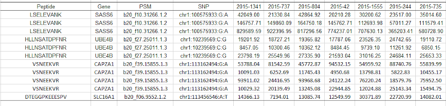
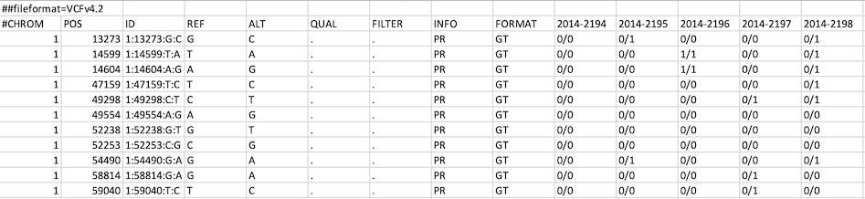

***

## Welcome to SMAP (Sample MAtching for Proteomics)!

***

 SMAP is a pipeline to <b> validate and correct sample identity </b> based on a combination of concordance and specificity scores. 

SMAP first detects variant peptides from multiplexed isobaric labeling-based quantitative proteomics data using the <b> proteogenomics approach </b>. 

Then it infers <b> allelic information </b> for each sample based on its expression level of the variant peptides. 

This shiny app allows users to input, visualize and filter their data interactively, run SMAP on their filtered data, and export the results!

You can visit the [Github page](https://github.com/XWangLab/SMAP) or the [Google webpage](https://sites.google.com/view/smapwanglab/home) for additional information on running SMAP from the command line. 

## How to Use

***

### 1. Input Data
+  Input a <b> variant peptide table </b> with the following format:  
  + Column 1: Peptide ID  
  + Column 2: Gene/Protein  
  + Column 3: Peptide Spectrum Match (PSM)  
  + Column 4: SNP ID <b><i> **MUST MATCH GENOTYPE SNP ID </b></i>  
  + Column 5-N: Sample Peptide Quantification (One column per sample)  
<b>Example:  </b>  
    

 

+ Specify if the input data is <b>log2 normalized</b> (if it is not, it will be normalized for you)  

 

+  Input a <b> genotype .vcf file </b> that follows the [vcf file format specifications](https://samtools.github.io/hts-specs/VCFv4.3.pdf)  
  + <b><i>**MISSING GENOTYPES MUST BE CODED AS "./."</b></i>  
  + <b><i>**EMPTY FIELDS MUST BE CODED AS "."</b></i>  
<b>Example:  </b>  

 

### 2. Visualize Distributions and Apply Filters
  + Because of the inherent noise of proteomics data, it is recommended that the peptide input be filtered before running SMAP  
  + View the <b>minimal intensity distribution</b> and set a filter to remove peptides with a minimal intensity above that value  
  + View the <b>maximal intensity distribution</b> and set a filter to remove peptides with a maximal intensity below that value  
  + View the <b>signal/noise distribution</b> and set a filter to remove peptides with a signal/noise ratio below that value
  + View the <b>missing genotype distribution</b> and select a maximum number of missing sample genotypes to tolerate for each SNP
  + <b><i> **NOTE: ALL FILTERS ARE ORIGINALLY SET AT DEFAULT VALUE </b></i>

 

### 3. Run SMAP!
+ Ensure desired filters are set, and hit run in the "Run SMAP" tab
+ View the SMAP output and Delta Cscore ~ Cscore plot and download the results table  

 

***

### 
 Support
  
#### 
 Please contact [Alyssa Erickson](mailto:alyssa.a.erickson@und.edu) or [Xusheng Wang](mailto:xusheng.wang@und.edu) for software support.

 

